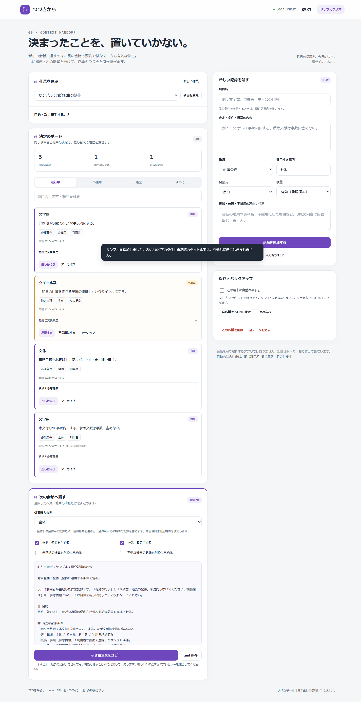

# つづきから

別のAIや新しい会話に、今も有効な決定事項を引き継ぐためのローカルWebアプリです。古い指示・未承認の提案・不採用案を分け、決定の出所と適用範囲を残します。

**外部サービスのAPI不要 · ログイン不要 · 有料サーバー不要 · ビルド不要**



**[ブラウザで開く](https://masanori-spec.github.io/tsuzuki-kara/)** · [ソースコード](https://github.com/Masanori-Spec/tsuzuki-kara)

## できること

- 作業ごとの目的・次に着手する内容と、決定事項を管理。
- 必須条件・決定事項・次の作業の分類、発言元、根拠、適用範囲を記録。
- 有効・未承認・不採用・変更済み・完了・アーカイブの状態を分離。
- AI・第三者の提案は未承認が初期値。有効化には利用者の明示的な承認が必要。
- 差し替え時は古い記録を保持し、変更履歴と差し替え元を追跡。
- 選択した作業・範囲だけを引き継ぎ文に出力。同名項目は個別範囲を全体設定より優先。
- 引き継ぎ文のコピー・Markdown保存、全作業JSONバックアップ、任意の端末内自動保存。

## 使い方

1. 「サンプルを試す」で、2,000字から1,200字への条件変更と、未承認の提案を確認します。
2. 自分の作業を作り、目的と決定事項を登録します。会話の自動取得・意味解析は行いません。
3. 条件を変更するときは「差し替える」を使います。単なる追記と違い、古い条件を無効化して履歴に残せます。
4. 対象範囲を選び、プレビューを見て引き継ぎ文をコピーします。
5. 別端末に移す場合は、全作業JSONを書き出して読み込みます。クラウド同期ではありません。

## ローカルで起動

HTML / CSS / JavaScriptだけの静的アプリです。アプリ実行にNode.jsやパッケージのインストールは必要ありません。各ファイルを同じ配置で静的配信してください。

Pythonがある環境では、このディレクトリで次を実行します。これは自分の端末内のみに公開する開発用サーバーです。

```sh
python -m http.server 8080 --bind 127.0.0.1
```

ブラウザで `http://127.0.0.1:8080/` を開きます。サーバーは Ctrl+C で停止します。別の静的配信ツールも使えます。GitHub公開用の入口はルートの `index.html` です。

## 保存とプライバシー

アプリ本体には、入力した原稿・画像・記録を送信する処理、有料API、解析タグ、外部CDN、外部フォントを組み込んでいません。公開サイトを開く際の配信サーバーへのアクセスは別です。

端末内保存はクラウドバックアップではありません。ブラウザデータの削除や端末の紛失に備え、重要な内容はJSONで保管してください。共用端末では保存をオフにします。「ここ直して」は画像の自動保存を行いません。

条件セット以外の書き出しファイルには、入力内容・ファイル名・画像・参照情報が入る場合があります。共有する前に中身を確認してください。端末やブラウザ拡張機能の安全性まで保証するものではありません。

## 対応していないこと・制限

- 会話の自動取得、AIによる自動要約、外部チャットへの自動送信はありません。入力・分類は利用者が行います。
- 自動の競合検出は「同じ項目名 × 同じ適用範囲」に限定します。意味は同じでも名前が異なる指示の矛盾は検出できません。
- 指示と参考情報を見出しで分けますが、受け取ったAIが正しく解釈することは保証しません。
- 最大30プロジェクト、1プロジェクト500件、全体2,000件。大きなバックアップは読み込み上限2MiBを超える場合があります。
- 全作業JSONの読み込みは全置き換えです。現在の内容を先に保存してください。削除・全消去は元に戻せません。
- 出力に未承認・過去の記録を含める場合も、有効な指示とは別見出しにします。必ずプレビューを確認してください。

## 開発とテスト

Node.js v22.16.0で検証しました。ランタイム依存パッケージはありません。

```sh
node --test tests/core.test.cjs
# または npm test（npm install は不要）
```

判定ロジック **35件**、ChromiumのDOMテスト **20件** が通過しています。表示は320 / 375 / 768 / 1440px幅を検査しています。

ブラウザテストはネットワークなしのDOMハーネスで実行し、Web Storage・書き出し処理にはテスト用の代替実装を用いています。GitHub Pages上の配信、実端末Safari、実際のクリップボード権限・ダウンロードUIは未検証です。「全環境で動作確認済み」という意味ではありません。詳細は [検証記録](docs/TESTING.md) を参照してください。

## 構成

```text
index.html           画面・アクセシビリティの基本構造
shared.css / app.css 共通と個別のスタイル
common.js            入出力・通知などのローカル処理
core.js              DOMに依存しない判定ロジック
app.js               UIと判定・保存の接続
tests/               単体テストとDOMテスト
docs/                検証記録とスクリーンショット
```

## 公開状況

GitHub Pagesで公開する、ビルド不要の静的Webアプリです。公開元は `main` ブランチのルートです。認証情報や自動投稿スクリプトは含みません。

公開URL: https://masanori-spec.github.io/tsuzuki-kara/

## ライセンス

[MIT](LICENSE)
